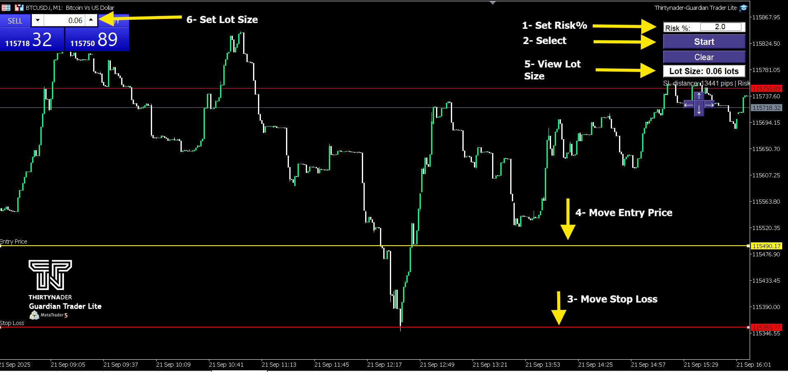

# Guardian Trader Lite (MT5)

It’s a Position Size & Risk Management tool for MetaTrader 5 that helps traders manage risk effectively. 
Easily manage your **risk**, **lot size**, and **entry setup** directly on the chart.

---

## Features
-  Drag & Drop **Stop Loss** and **Entry Price** lines.
-  Auto-calculates **lot size** based on account balance and risk %.
-  Adjustable panel (move anywhere on chart).
-  Lightweight, simple, and user-friendly.

---

## How to Use
1. Attach the EA to your chart.
2. Click **Start** to generate Entry & Stop Loss lines.
3. Drag the lines to your desired price levels.
4. Enter your **risk %** in the input field.
5. Lot size will be calculated automatically.

---

## Screenshots

### Panel and Lines

### Settings

---

## Inputs
| Input              | Description              | Default |
|--------------------|--------------------------|---------|
| StopLossColor      | Stop Loss line color     | Red     |
| EntryLineColor     | Entry line color         | Yellow  |
| LineWidth          | Line thickness           | 2       |

---

## Notes
- This EA does **not** open trades automatically. It only helps calculate position size.
- Works on all symbols and timeframes.
- **According to money management rules, I recommend always setting the risk percentage between 1% and 2%.**

---

## 📥 Download

[Download Guardian Trade Lite (EX5)](https://github.com/Thirtynader/Guardian-Trade-Lite-MT5-/releases/download/1.00/Thirtynader-Guardian.Trade.Lite.ex5)

Place the downloaded **EX5 file** in your `MQL5/Experts` folder and restart MetaTrader 5.

## License
MIT © [Thirtynader](https://github.com/Thirtynader)

